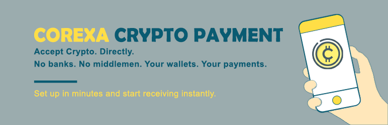
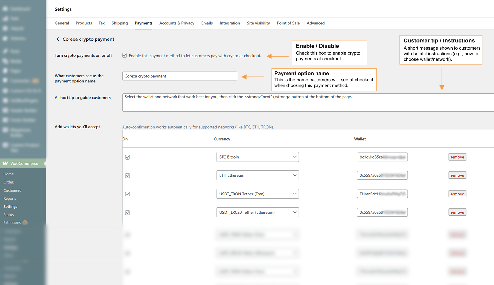
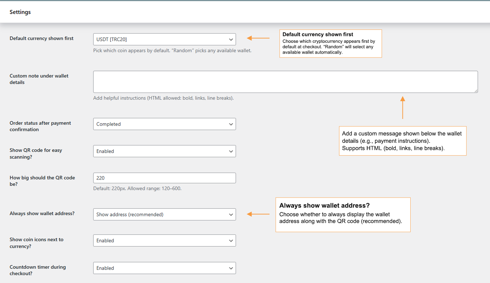
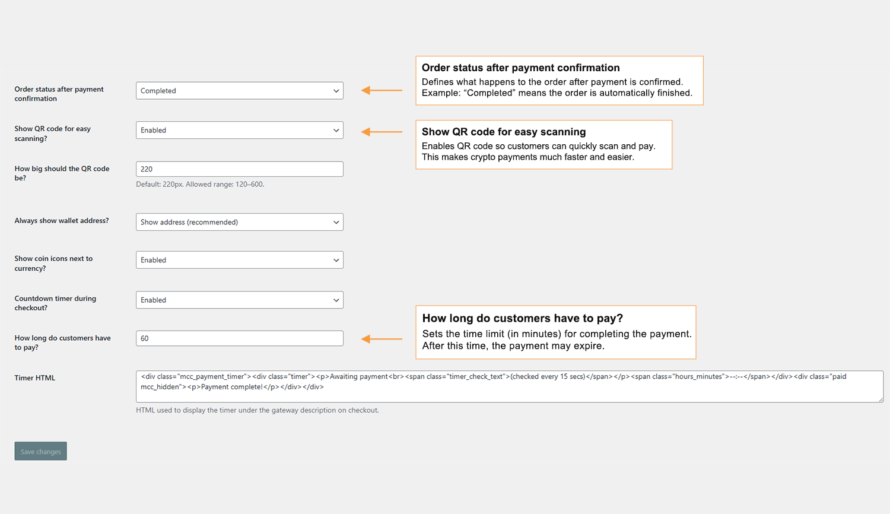
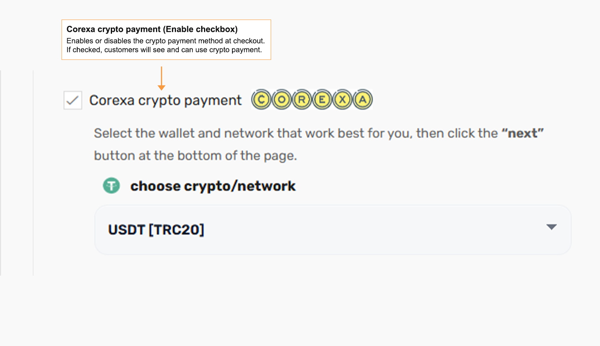
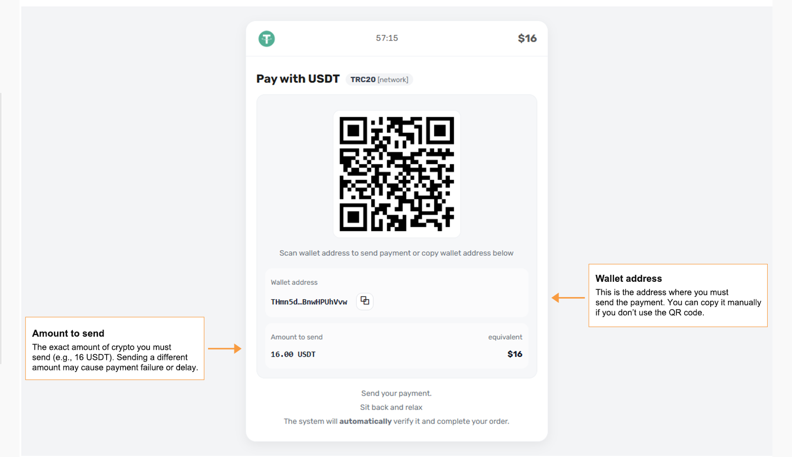

# 🚀 Corexa – Crypto Payment Gateway for WooCommerce

Accept cryptocurrency payments directly to your own wallets — no third parties, no KYC, no extra fees.

---

## 🔥 Overview

**Corexa** is a powerful WooCommerce crypto payment gateway that lets you accept payments in cryptocurrency directly into your own wallet addresses.

No middlemen. No signups. No restrictions.

Just plug in your wallet and start receiving crypto payments globally.

---

## ✨ Features

- 💰 **Multi-Coin Support**  
  Accept BTC, ETH, USDT, SOL, XRP, BNB, DOGE, TRON, USDC and more

- 🧠 **Smart Checkout**  
  Customers choose their preferred network easily

- 📱 **QR Code Payments**  
  Auto-generated QR codes for fast and accurate transfers

- ⚡ **Automatic Verification**  
  Orders update automatically after blockchain confirmation

- 📝 **Custom Instructions**  
  Add helpful payment notes for your customers

- 🔒 **Privacy First**  
  No custody — funds go directly to your wallet

- 🚫 **No API Required**  
  Simple setup, beginner-friendly

---

## ⚙️ How It Works

1. **Connect your wallet**  
   Add your crypto wallet addresses in settings

2. **Customer checkout**  
   User selects crypto payment option

3. **Send crypto**  
   Customer sends payment manually

4. **Auto confirmation**  
   Corexa verifies transaction on blockchain and updates order

---

## 🖼️ Screenshots

### 1. Gateway Settings

### 2. Wallet Configuration

### 3. Advanced Settings

### 4. Checkout Crypto Selection

### 5. Thank You Page (QR + Details)

---

## 🔌 Installation

1. Upload plugin to your WordPress site
2. Activate the plugin
3. Make sure WooCommerce is installed
4. Go to **WooCommerce → Settings → Payments**
5. Enable **Corexa Crypto Payment**
6. Add your wallet addresses

---

## 🌐 External Services

Corexa uses public blockchain APIs to verify transactions.

No personal customer data is sent.

### Used services include:

- Etherscan (Ethereum)
- BscScan (BSC)
- PolygonScan (Polygon)
- BaseScan (Base)
- TronGrid (TRON)
- Stellar Horizon (XLM)
- XRPSCAN (XRP)
- Solana RPC
- Blockfrost (Cardano)
- NOWNodes (XVG)
- Tatum (BTC, LTC, DOGE, etc.)
- CoinGecko (price conversion)

---

## ❓ FAQ

### Does it verify payments automatically?
Yes — Corexa checks blockchain confirmations and updates orders automatically.

### Do I need a third-party service?
No. Payments go directly to your wallet.

### Does the plugin hold funds?
No. You are always in full control.

### Are there fees?
Corexa itself does not charge any fees.

---

## 📦 Changelog

### 1.0.0
- Initial release

---

## 🔗 WordPress Plugin Page

👉 https://wordpress.org/plugins/corexa-crypto-payment/

---

## ❤️ Support

If you find bugs or have suggestions, feel free to open an issue or contact us.

---

## 📜 License

GPLv2 or later  
https://www.gnu.org/licenses/gpl-2.0.html
